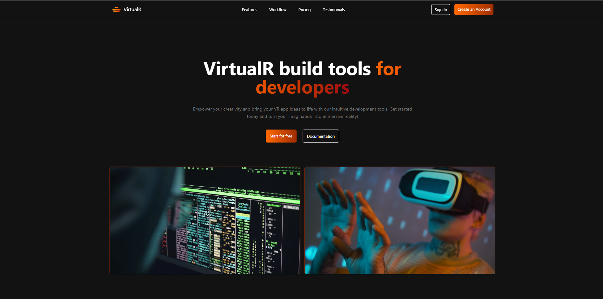

# 🌐 VirtualR  

Landing page moderna e totalmente responsiva, desenvolvida em **React** com **Tailwind CSS**.  
O projeto foi criado pensando em organização, performance e escalabilidade, com uma estrutura baseada em **componentes reutilizáveis** e conteúdos dinâmicos.  

---

## ✨ Features  

- ⚛️ **React + Tailwind CSS** → Layout moderno, responsivo e com design limpo.  
- 📱 **Mobile Menu** → Navegação interativa e controlada por *states* do React.  
- 🧩 **Componentização** → Estrutura dividida em *sections* independentes e fáceis de manter.  
- 📂 **Arquivo de Constantes** → Todo conteúdo centralizado em um arquivo separado, renderizado dinamicamente com `map()`.  
- 💡 **100% Responsiva** → Se adapta a qualquer dispositivo, do celular ao desktop.  

---

## 📂 Estrutura do Projeto  

src/
├── components/ # Componentes reutilizáveis
├── data/ # Arquivo de constantes para os conteúdos das sections
├── sections/ # Cada parte da landing page organizada por section
├── App.jsx # Estrutura principal
└── index.jsx # Ponto de entrada do React


---

## 🚀 Como rodar o projeto  

1. Clone o repositório:  
```bash
git clone https://github.com/seu-usuario/virtualR.git
cd virtualR
npm install
# ou
pnpm install
# ou
yarn install
npm run dev


 🛠️ Tecnologias utilizadas
- React.js
- Tailwind 
- JavaScript (ES6+)

---
